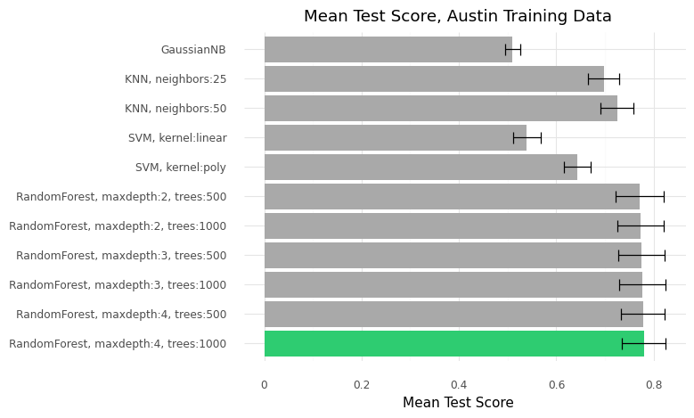
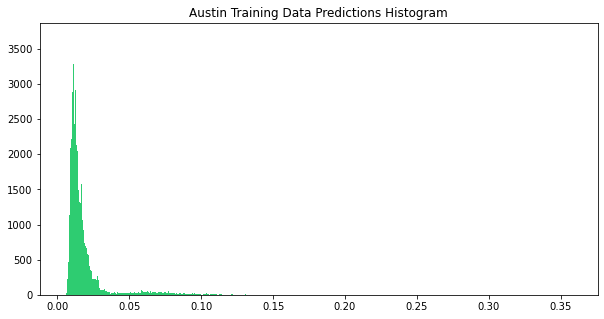
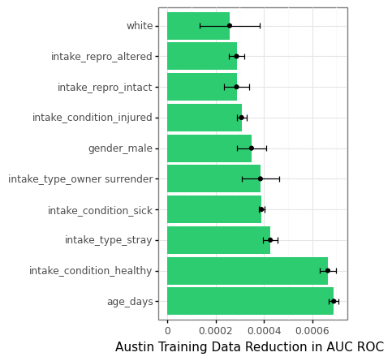

```{r setup, include=FALSE}
library(knitr)
library(tufte)
knitr::opts_chunk$set(echo = TRUE)
```

:::{.fullwidth}
# 1. Introduction
This project seeks to predict the likelihood of a dog entering an animal shelter being euthanized and to identify which characteristics most effectively determine a dog's outcome. This information would potentially aid shelters in allocating resources and reducing the total number of euthanasias. The project commences with an overview of the challenges facing animal shelters before exploring the data used and presenting the models and predicted results.
<br><br>
:::

:::{.fullwidth}
# 2. Problem Statement and Background
The good news is that euthanasias are on the decline. The New York Times reported in 2019 that over the last decade, euthanasia rates had dropped in more than twenty cities.$^1$ Research suggests that the initial drop could be attributed to a decrease in animals taken in, but that the figures remain lower possibly due to a combination of increased activism, better means of returning strays to their owners, and adoption growing in popularity.$^2$

Even so, there is a lack of comprehensive or even cohesive data regarding national trends, let alone the relative success of animal shelters, at more than an broad aggregate level of basic statistics.$^3$ There has been limited application of data analysis to one of the data sets included below$^4$, but there is ample room for further exploration and predictive application. While shelter staffs certainly have anecdotal experience as to which dogs may be more difficult to place in a home, there's an overall lack of data-driven insights that could be strategically deployed to improve processes and outcomes for shelters and animals alike.
<br><br>
:::


:::{.fullwidth}
# 3. Data
The data used throughout this project comes from shelters in Austin, TX, Dallas, TX, and Louisville, KY via the OpenData.gov platform. Each dataset contains observations of individual animals dating back to 2014. The variables of most interest across these data sets include:

- The dog's breed(s)
- The dog's gender and age
- The dog's physical characteristics
- How and when the dog arrived at the animal shelter

While Austin and Louisville share most relevant variables in common with a few minor exceptions, Dallas is notably distinct in that it does not provide records regarding a dog's gender, age, color, or reproductive status.
<br><br>
:::

:::{.fullwidth}
## 3.1 Data Wrangling Methods

Between disparate data types and inconsistent descriptions across many of these categorical features, a great deal of data wrangling was involved to prepare for analysis.
<br><br>
:::
:::{.fullwidth}
### Categorical Transformations

Each category went through a pruning process to maintain as much information as possible while consolidating the categorical features into a reasonable list that could then be standardized across all three data sources for easier comparison of the models.

In some cases, this involved transforming a single categorical variable into a series of binary dummy variables for whether a dog identified as the particular category or not. For a dog's color for instance, the data needed to be transformed so that "brown/white", "white/brown", and other variations all captured that a dog had brown and white coloration. In other categories, such as Intake Type, which denotes how the dog arrived, such as being an owner surrender or stray, there were several entries that appeared infrequently or were redundant. These entries were 'folded into' other categories to reduce the number of unique entries with as little information lost as reasonably possible.
<br><br>
:::

:::{.fullwidth}
### Age

Two shelters also provided data regarding the dog's age. It is worth noting these are almost certainly a combination of approximations made by shelter staff and accurate values provided by owners. While this could in theory diminish the predictive power of the feature, since these inconsistencies will be equally applicable to new animals entering the shelter, the potential error is mitigated for the purposes of identifying at-risk animals.
<br><br>
:::
:::{.fullwidth}
### Breed 

One of the largest data wrangling undertakings involved working with the dog's breed description column. When considering all three data sources, there were nearly 5,000 unique entries for this variable. To reduce the noise present, the data was transformed into a set of binary dummy variables, one for each unique breed appearing in the dataset as recognized by the American Kennel Club.

Similar to the dog's color variable, it was crucial to capture that a 'German Shepherd' and a "Ger Shep' were the same breed, and that a "Pit Bull Mix" and "Pit Bull / Bulldog" were both identified as a "Pit Bull". To this end, several layers of text replacement processes standardized the various shorthands or colloquial names of dog breeds. Then, each breed dummy variable represented if the breed name appeared in the original breed description column. While not the most time-efficient way to condense the breed variations, it retained the most information to make sure that dogs of mixed breeds would have each breed represented.
<br><br>
:::
:::{.fullwidth}
### Breed Groups

Each dog was then categorized by the Breed Groups, also denoted by the AKC. This categorization was intended to help the model make connections between animals it might otherwise not. While intuitively humans might understand that a "Jack Russell Terrier" and a "Bulldog Terrier" are similar just from the common family name, these are simply different combinations of binary inputs to the model. By adding another binary output, these two breeds would have a variable in common, which might help inform the model's construction.

It's also worth noting the ways in which this could work against breeds that are outliers. Staffordshire Terriers, for instance, colloquially in the "Pit Bull" category as well, likely have a different distribution of outcomes than their smaller terrier counterparts, and thus the Breed Group categorization may work against the model in certain instances when these differences are pronounced. How the model handled these features became an important aspect of the feature reduction process.
<br><br>
:::
:::{.fullwidth}
# 4. Analysis
:::
:::{.fullwidth}
## 4.1 Exploratory Data Analysis
:::
:::{.fullwidth}
Before working with models, it is worth briefly exploring the training data to get a sense of the data and a few prominent trends.
:::
:::{.fullwidth}
### Dependent Variable: Euthanasias by City
:::
:::{.fullwidth}


:::
:::{.fullwidth}
Even from only comparing the aggregate sums for euthanasias or live releases in each city, it is clear the difference operating as a no-kill shelter can have, with Austin leading both in the number of animals taken in, and by far the fewest euthanasias, both in terms of their euthanasia rate (1.8%) and the summed total as well. Dallas follows with an average rate of 17% euthanasias since 2014. Louisville has an average euthanasia rate of 36%.
<br><br>
:::
:::{.fullwidth}
### Independent Variables: Intake Type & Condition
:::
:::{.fullwidth}


:::
:::{.fullwidth}
Considering two of the more robust categorical variables in the dataset, it's clear the majority of animals across all three cities are entering the system as strays and relatively healthy. Owner surrenders are the second-most common reason for intake.
<br><br>
:::
:::{.fullwidth}
## 4.2 Model Selection
One of the goals of this project was to evaluate several machine learning techniques in their ability to model a large dataset of mostly binary variables. With this structure in mind, Random Forests were intuitive inclusions, since their branching structure is built to handle dichotomous inputs naturally. Naive Bayes was included as a baseline for comparison. K-Nearest Neighbors and Support Vector Machine models were also included to test their robustness against high dimensionality. Each model was tuned with relatively modest parameters for initial fits run on the training data.
:::
:::{.fullwidth}
<div align='center'>

</div>
:::
:::{.fullwidth}
Above are the mean test score averaged over the ten-fold cross validation process. This step is taken to train and evaluate the model for comparison and further tuning requirements. In this instance, Naive Bayes performed little better than a coin toss. Support Vector Machines provided only a slight boost. K-Nearest Neighbors performed notably better than the two former models, particularly as more neighbors were considered. Random Forests performed best, reinforcing the natural fit between the structure of the data and model. From here, the project shifted to further exploring tuning parameters of the Random Forest model.
<br><br>
:::
:::{.fullwidth}
## 4.3 Model Tuning

With three models implemented to better understand each shelter's reality, this section uses Austin as an example of the process as it is both a complete dataset and provides a unique challenge due to its comparatively low support of euthanasia outcomes found in the training data.
<br><br>
:::
:::{.fullwidth}
### Evaluation Metrics

Prior to considering the random forest models and pre-processing techniques deployed, it is worth previewing the predicted output of the Austin training data model to better understand the process. Depicted below is the prediction results from a random forest, which can be interpreted as "the percent of decision trees that vote that a particular animal is euthanized."
:::
:::{.fullwidth}
<div align='center'>

</div>
:::
:::{.fullwidth}
With such a small sample of euthanasias (~1500, or <2% of the training dataset), the model understandably predicts conservatively, with a majority less than 0.1. As such, one must consider what output is of the most substantive importance, which can be further assessed via precision and recall.
<br><br>
:::
:::{.fullwidth}
### Precision & Recall

It can be helpful to think of precision and recall in the context of the project's purpose. For predicting euthanasias, precision is the proportion of how many dog's outcomes were correctly predicted. Recall is the proportion how many dogs that were actually euthanized were correctly identified.

In this project, recall is favored, as the model is intended to identify as many at-risk animals as possible. There is  an inherent tradeoff between these two metrics, however. To make the model more sensitive, increasing the number of euthanized dogs correctly identified, means in turn decreasing how specific the model can be with its identification, decreasing precision. The opposite is also true.

This tradeoff can be adjusted by determining the threshold where the model rounds the predicted probability to 1. For each Austin model considered, based on testing and the distributions above (which were consistent across all models), the threshold was set at 0.05. Each model and technique presented below is thus evaluated based on a combination of the mean test score and the precision and recall tradeoff to balance both statistical and substantive metrics of success.
<br><br>
:::
:::{.fullwidth}
### Parameters
Since the Random Forest outperformed models even with modest parameters, additional rounds of parameter tuning focussed on further exploring how many trees would constitute the forest and the allowed depth of each tree. With approximately 80,000 rows and 250 columns, it made sense that significantly more trees and larger subsets of columns could improve the model's power and generality when the trees were aggregated together. The parameters ended up being on the larger end of the spectrum tested with 1000 trees and twenty layers.
<br><br>
:::
:::{.fullwidth}
## 4.4 Feature Reduction
Early in the model tuning process, it became a question as to whether the volume of features was weighing down the model's ability to generalize or would increase precision and recall. A pair of feature reduction techniques were considered to address this theory.
<br><br>
:::
:::{.fullwidth}
### Permutation Importance Test
As shown above, variable importance evaluations were conducted using a permutation importance test. This process artificially distorts each column in the dataset interactively to see how much information is lost in the process and indirectly determines how much the results depend on that feature.

At the other end of this list, more than 150 variables had no importance. This subset included under-represented breeds, infrequent categorical dummy variables, and the 'misc' breed group. Experiments were run to test the model's effectiveness if these variables were dropped. Theoretically, this specification suggested the model might perform better, since more important variables would construct the underlying decision trees more consistently. The best model provided a slightly higher mean test score, but lowered both precision and recall.
<br><br>
:::
:::{.fullwidth}
### Principal Component Analysis
Principal Component Analysis is a mathematical process in which many features are reduced to a subset of linear algebra combination of the most important variables. While there is a loss of interpretability, one would assume the stacking of important variables would boost the predictive power. As above, the Mean Test Scores were not demonstrably different, especially considering the slight reduction in both precision and recall.

Thus, with multiple avenues of feature reduction explored, the project proceeded with the original dataset, as it maintained a similar metrics with higher precision and recall. This trend proved to be consistent when implementing the other datasets as well.
<br><br>
:::
:::{.fullwidth}
# 5. Results
:::
:::{.fullwidth}
## 5.1 Austin
With a final model in mind, it is helpful to consider the model's results in more concrete terms.
:::
:::{.fullwidth}
<div align='center'>


</div>
:::

:::{.fullwidth}
<div align='center'>
```{r echo=FALSE}
df_austin_train <- data.frame(Austin = c("0", "1", "accuracy", "macro avg", "weighted avg"),
                 precision = c("0.99", "0.14", " ", "0.57", "0.97"),
                 recall = c("0.95", "0.42", " ", "0.69", "0.94"),
                 f1_score = c(0.97, 0.21, 0.94, 0.59, 0.96),
                 support = c(79729, 1499, 81228, 81228, 81228)
                 )

knitr::kable(df_austin_train)
```
</div>
:::

:::{.fullwidth}
This visualizes, with the 0.05 threshold, the distribution of predicted and true labels for each dog in the training data. 76,357 dogs non-euthanized dogs were correctly labeled, whereas 3372 were given a probability higher than 5% and rounded up to a 1 label. Here the 0.23 precision conveys how many dogs identified as 'high-risk' were actually euthanized. The model correctly identified 1030 out of 1499 euthanasias, a recall of 0.69. Finally, 469 dogs were euthanized and not identified correctly.

So, how well does the model handle unseen data?
:::

:::{.fullwidth}
<div align='center'>

</div>
:::
:::{.fullwidth}
<div align='center'>
```{r, echo=FALSE}
df_austin_test <- data.frame(Austin = c("0", "1", "accuracy", "macro avg", "weighted avg"),
                 precision = c("0.99", "0.11", " ", "0.55", "0.97"),
                 recall = c("0.95", "0.32", " ", "0.64", "0.94"),
                 f1_score = c(0.97, 0.16, 0.94, 0.56, 0.95),
                 support = c(26565, 512, 27077, 27077, 27077)
                 )

knitr::kable(df_austin_test)
```
</div>
:::
:::{.fullwidth}
Not very well.

There is a stark drop off in both precision and recall when fitting new data. With these results suggesting that the model could be overfit, the PCA model was also reevaluated against the PCA version of the test data to similar results.

Thus, Austin's lack of predictive power seems to originate not so much from overfitting (though this still may be present), but more-so the low support for the euthanasia outcomes in the dataset. It's great news in practice, but less encouraging for the expected value of the implemented model.
<br><br>
:::
:::{.fullwidth}
## 5.2 Dallas 

With important variables missing, the Dallas model relies more heavily on intake type and condition. As such, it seems the observations overlap more in this dataset than others, making it difficult to parse out meaningful results. At the 0.5 threshold, the model struggles to identify at-risk animals, missing 3/4 of the euthanasia outcomes.
:::
:::{.fullwidth}
<div align='center'>


</div>
:::

:::{.fullwidth}
<div align='center'>
```{r echo=FALSE}
df_dallas_train <- data.frame(Dallas = c("0", "1", "accuracy", "macro avg", "weighted avg"),
                 precision = c("0.86", "0.78", " ", "0.82", "0.85"),
                 recall = c("0.99", "0.22", " ", "0.60", "0.85"),
                 f1_score = c(0.92, 0.35, 0.85, 0.63, 0.82),
                 support = c(21403, 4472, 25875, 25875, 25875)
                 )

knitr::kable(df_dallas_train)
```
</div>
:::


:::{.fullwidth}
Dallas's muddied results do not offer the same clear threshold as Austin. Even trying other cutoffs, any shift in sensitivity leads to a disproportionately higher rate of false positives. One benefit of the results is that if the model were used to create a list of at-risk animals, the majority would actually be at risk. Even so, regardless of threshold, a majority of at-risk animals are not successfully identified. 

As expected, the model does not fare better on unseen data.
:::
:::{.fullwidth}
<div align='center'>

</div>
:::

:::{.fullwidth}
<div align='center'>
```{r echo=FALSE}
df_dallas_test <- data.frame(Dallas = c("0", "1", "accuracy", "macro avg", "weighted avg"),
                 precision = c("0.85", "0.76", " ", "0.81", "0.84"),
                 recall = c("0.99", "0.20", " ", "0.59", "0.85"),
                 f1_score = c(0.92, 0.32, 0.85, 0.62, 0.81),
                 support = c(7122, 1503, 8625, 8625, 8625)
                 )

knitr::kable(df_dallas_test)
```
</div>
:::

:::{.fullwidth}
Once again, the most positive takeaway is that if the model were to generate a list of ~400 at-risk animals, 300 would be accurately highlighted. Unfortunately, ~1200 animals would not be prioritized.

One would assume at least some degree of uncertainty can be attributed to missing many of the variables shown to be important in other datasets.
<br><br>
:::
:::{.fullwidth}
## 5.3 Louisville

Similar to Austin, a random forest model (20 layers, 500 trees) using the entire Louisville dataset proved to be the best fit model. Because Louisville's data does not suffer from missing features nor low support for either outcome, it is potentially positioned to predict more accurately than either previous model.
:::
:::{.fullwidth}
<div align='center'>


</div>
:::

:::{.fullwidth}
<div align='center'>
```{r echo=FALSE}
df_louisville_train <- data.frame(Louisville= c("0", "1", "accuracy", "macro avg", "weighted avg"),
                 precision = c("0.85", "0.82", " ", "0.83", "0.84"),
                 recall = c("0.91", "0.72", " ", "0.81", "0.84"),
                 f1_score = c(0.88, 0.77, 0.84, 0.82, 0.84),
                 support = c(34480, 20090, 54570, 54570, 54570)
                 )

knitr::kable(df_louisville_train)
```
</div>
:::

:::{.fullwidth}
Across the training data using the default 0.5 threshold, the model correctly identifies 72% of the euthanized animals and only mis-identifies 18% of the animals it predicts as at-risk. As discussed, the recall-precision trade-off can be further tweaked depending on desired sensitivity. Using a 0.4 threshold, for example, correctly identifies 84% of all euthanized observations while only adding 7% more false positives.

More importantly, this model performs comparatively well with new data.
:::
:::{.fullwidth}
<div align='center'>

</div>
:::

:::{.fullwidth}
<div align='center'>
```{r echo=FALSE}
df_louisville_test <- data.frame(Louisville= c("0", "1", "accuracy", "macro avg", "weighted avg"),
                 precision = c("0.88", "0.70", " ", "0.79", "0.81"),
                 recall = c("0.80", "0.80", " ", "0.80", "0.80"),
                 f1_score = c(0.84, 0.75, 0.80, 0.79, 0.80),
                 support = c(11596, 6594, 18190, 18190, 18190)
                 )

knitr::kable(df_louisville_test)
```
<br>
</div>
:::

:::{.fullwidth}
These test data results are by far the strongest and most generalizable of any considered model. Including many of the variables missing from Dallas and more euthanasia outcomes than Austin, Louisville's boost in predictive power is likely a combination of both stronger support and more robust features.
<br><br>
:::
:::{.fullwidth}
## 5.4 Conclusions
:::
:::{.fullwidth}
Perhaps counter-intuitively, the worse a shelter is doing in limiting euthanasias, the easier it is to identify 'high-risk' animals.

In Austin, where euthanasias only occur 1.8% of the time, it can be difficult to set a sufficiently wide filter without the noise to signal ratio becoming an issue for capacity limitations.

In Dallas, the success of the model is limited by key missing variables, but it still performs better than the more complete dataset that has fewer euthanasia outcomes.

Louisville's data avoids both of these limitations and the model is much more successful across the board. In fact, the Louisville model performs better on test data than the other two models performed on the training data. 

This realization is an encouraging sign — the animal shelters needing the most help are those best suited for the model to provide meaningful results.
<br><br>
:::
:::{.fullwidth}
# 6. Discussion
:::
:::{.fullwidth}
## 6.1 Project Goals
At the onset, I listed three determinants of success for this project.

1. Observe noteworthy comparisons between disparate programs.
2. Identify trends in predicting individual animal's outcomes.
3. Evaluate a range of models and what determines their effectiveness.
<br><br>
:::
:::{.fullwidth}
## 6.2 Project Evaluation

In comparing different shelters, this project was a success, though not to the degree outlined in the proposal. The models do not generalize as hoped due to incongruous variables and their relative importance. Even so, being able to compare models themselves provided noteworthy insights.

For the second goal, the model did identify several prominent variables in predicting a dog's outcome, although the features do generally conform to prior expectations. Further, only Louisville's model suggests results worth potentially deploying.

Finally, the project succeeded in being a valuable vehicle through which to better evaluate and understand a handful of machine learning models. Tuning each model and given consideration to how they might best suit high dimensionality and larger datasets than I had previously worked with was an insightful opportunity to better understand the statistical concepts underpinning each model.
<br><br>

:::

:::{.fullwidth}
## 6.3 Future Research

For future iterations, it would be an interesting shift to run a similar model but with a categorical dependent variable. Because there are multiple outcomes for non-euthanasias such as a dog being transferred, adopted, or returned to their owner, perhaps some of the poor classification is a result of the multi-faceted nature of outcomes in general. Building models to target multiple outcomes could lead to more nuanced classification capabilities or interesting trends as to how the models classify each observation. Such an approach might highlight shortcomings of this project as well as address new, interesting challenges to more accurately predict outcomes for each dog.

:::
<br><br><br><br>
<hr>
:::{.fullwidth}
### Work Cited
1: Alicia Parlapiano, "Why Euthanasia Rates at Animal Shelters Have Plummeted," New York Times, Sep 3, 2019. https://www.nytimes.com/2019/09/03/upshot/why-euthanasia-rates-at-animal-shelters-have-plummeted.html (accessed Dec 15, 2021).

2: Rowan A, Kartal T. Dog Population & Dog Sheltering Trends in the United States of America. Animals (Basel). 2018;8(5):68. Published 2018 Apr 28. doi:10.3390/ani8050068

3: Shelter Animals Count. “Dashboards” Shelter Animals Count: The National Database." Accessed December 16, 2021. https://www.shelteranimalscount.org/data-dashboards. 

4: Kaggle. "Austin Animal Center Shelter Intakes and Outcomes." Kaggle. Accessed December 15, 2021. https://www.kaggle.com/aaronschlegel/austin-animal-center-shelter-intakes-and-outcomes


:::